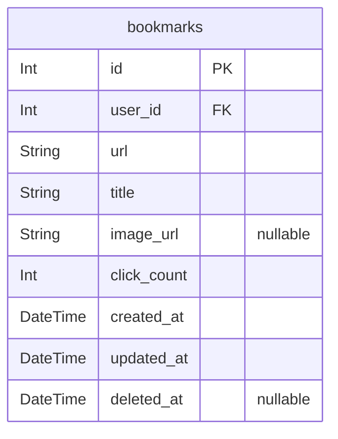
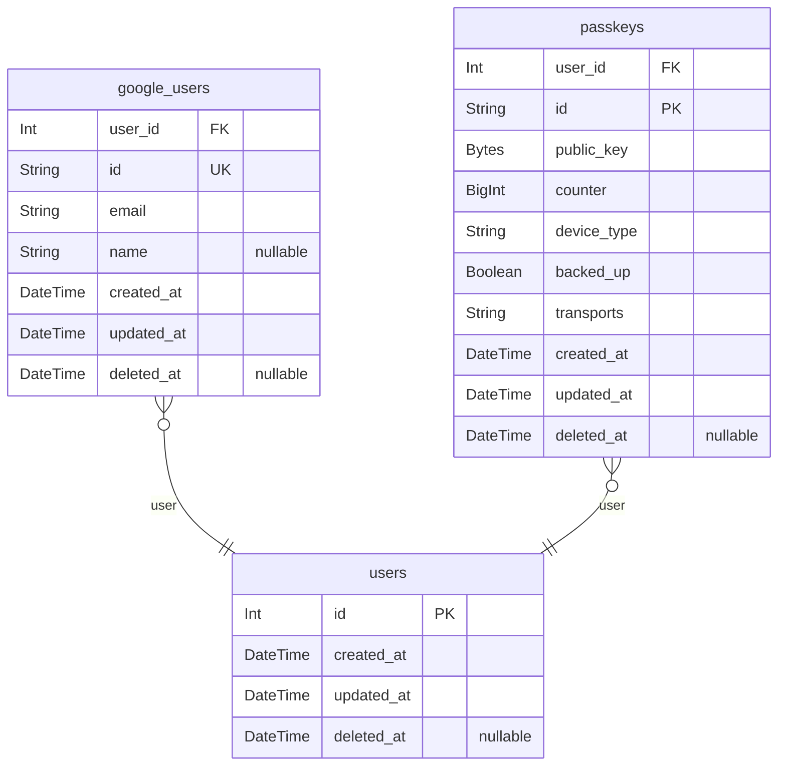

# Schema
> Generated by [`prisma-markdown`](https://github.com/samchon/prisma-markdown)

- [ブックマーク](#ブックマーク)
- [認証](#認証)

## ブックマーク

### `bookmarks`
ブックマーク

**Properties**
  - `id`: 
  - `user_id`: 
  - `url`: URL
  - `title`: ページタイトル
  - `image_url`: ページサムネイル
  - `click_count`: クリックカウント
  - `created_at`: 
  - `updated_at`: 
  - `deleted_at`: 

## 認証

### `google_users`
Googleユーザー

- https://developers.google.com/identity/openid-connect/openid-connect?hl=ja#an-id-tokens-payload

**Properties**
  - `user_id`: 
  - `id`
    > ユーザーの識別子。
    > すべての Google アカウントの中で一意であり、再利用されることはありません。
    > Google アカウントは、異なる時点で複数のメールアドレスを持つことができますが、sub 値は変更されません。
  - `email`
    > ユーザーのメールアドレス。
    > このクレームの値はこのアカウントに対して一意ではなく、時間の経過とともに変化する可能性があるため、ユーザー レコードにリンクするメインの識別子としてこの値を使用しないでください。
  - `name`: 表示可能な形式でのユーザーの氏名。
  - `created_at`: 
  - `updated_at`: 
  - `deleted_at`: 

### `passkeys`
Passkey

- https://simplewebauthn.dev/docs/packages/server#additional-data-structures

**Properties**
  - `user_id`: 
  - `id`: The credential's credential ID for the public key
  - `public_key`: The credential's public key
  - `counter`
    > The number of times the authenticator reported it has been used.  
    > **Should be kept in a DB for later reference to help prevent replay attacks!**
  - `device_type`
    > Whether this is a single-device or multi-device credential.  
    > **Should be kept in a DB for later reference!**
  - `backed_up`
    > Whether or not the multi-device credential has been backed up.  
    > Always `false` for single-device credentials.   
    > **Should be kept in a DB for later reference!**
  - `transports`
    > The transports of the credential record.  
    > `'ble' | 'cable' | 'hybrid' | 'internal' | 'nfc' | 'smart-card' | 'usb'`
  - `created_at`: 
  - `updated_at`: 
  - `deleted_at`: 

### `users`
ユーザー

**Properties**
  - `id`: 
  - `created_at`: 
  - `updated_at`: 
  - `deleted_at`: 